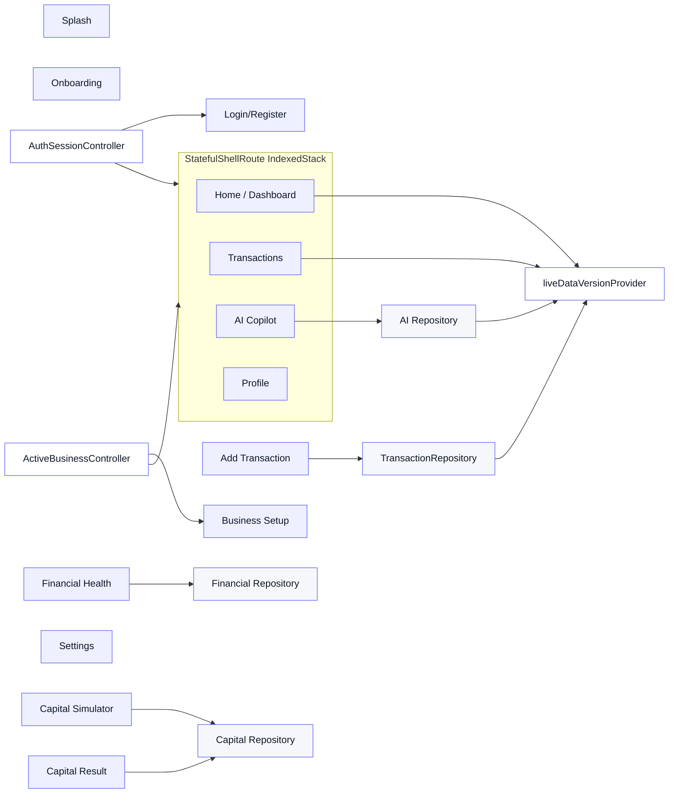
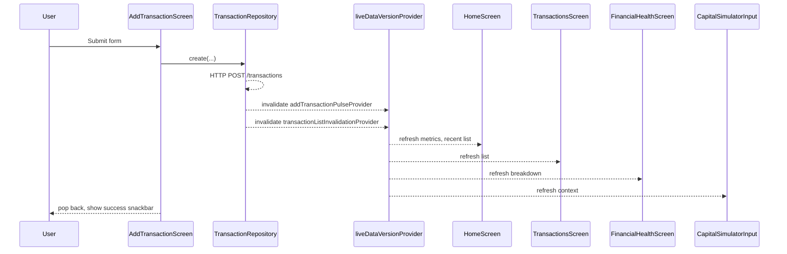
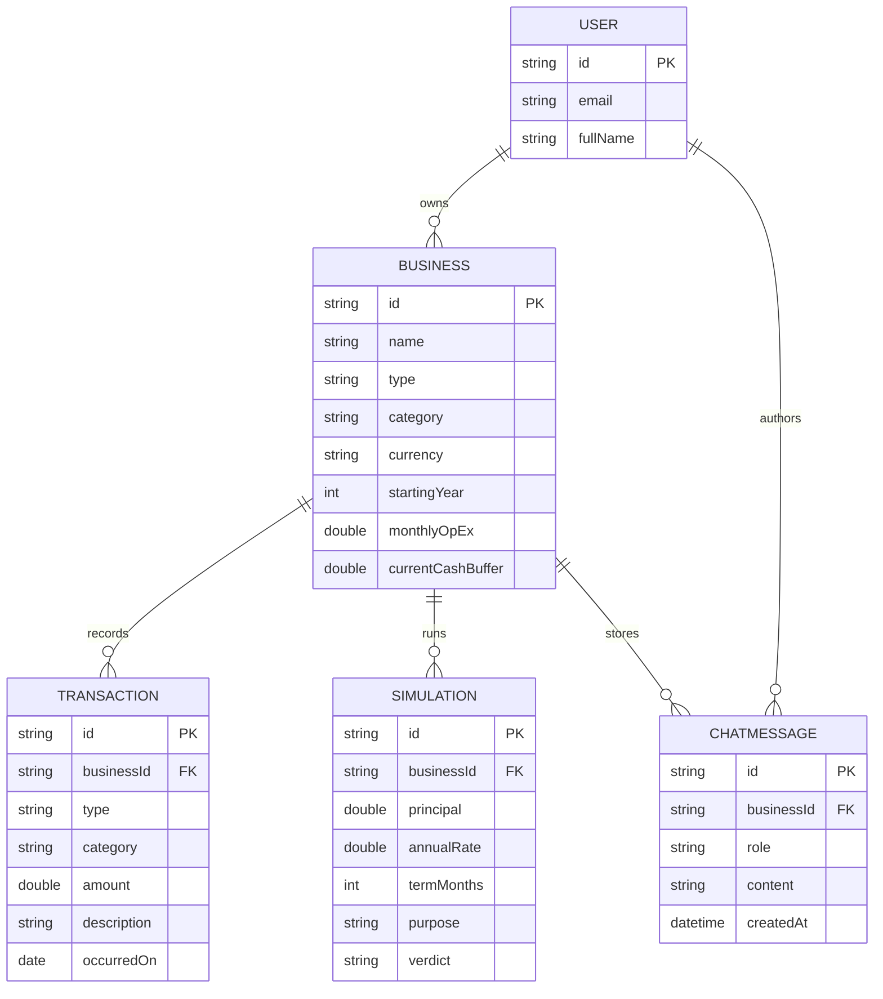

## Plan: FinoraTwin Premium Redesign

TL;DR: Refactor the existing `core/theme` + `core/widgets` into a unified Finora design system, introduce a `StatefulShellRoute` with a real bottom navigation (Home / Transactions / AI Copilot / Profile), wire live dashboard refresh from the existing `transactionListInvalidationProvider`, fix the add-transaction keyboard safety, polish the AI Copilot response rendering, and upgrade the Capital Simulator and Financial Health visuals. Backend, auth, financial math, AI/Groq integration stay untouched. ZERO comments in all new code.

**Steps**

1. **Inspect (already done in this conversation).** Confirmed: `FinoraColors` (indigo-500 brand, indigo-600 dark, surface/surfaceAlt, positive/negative/warning + healthStrong/Healthy/Fair/Weak), `FinoraTheme.light/dark`, `FinoraSpacing`, `FinoraGradients`, `AppScaffold` (title, actions, scroll, padding, bottom), `AppCard`, `AppPrimaryButton/SecondaryButton`, `AppTextField`, `AppCard`, `CurrencyFormat` (BDT → `৳`), `transactionListInvalidationProvider` already cascades from `TransactionRepository.create`, `activeBusinessControllerProvider` + `activeBusinessCurrencyProvider`, routes for splash/onboarding/login/register/forgot-password/business-setup/dashboard/transactions(+add)/capital-simulator(+result)/health/ai-copilot/profile/settings.

2. **Design system refactor (`lib/core/`).** Extend `finora_theme.dart` with `FinoraSpacing` (xxs…xxxl), `FinoraRadius` (sm/md/lg/xl/2xl/pill), `FinoraElevation` (flat/low/med/high), `FinoraMotion` (durations + curves), and richer gradients (`FinoraGradients.hero`, `FinoraGradients.brand`, `FinoraGradients.positive`, `FinoraGradients.negative`, `FinoraGradients.warning`, `FinoraGradients.health(score)`). Add `FinoraTextStyles` (`display`, `h1–h4`, `title`, `subtitle`, `body`, `caption`, `overline`, `metric`, `button`) wired into `TextTheme` via `FinoraTheme.light/dark`. Tint TextField border on focus = `brandPrimary`, error = `negative`, success = `positive`. No comments.

3. **New reusable components (`lib/core/widgets/`).** Add `FinoraAppBar` (gradient title, optional trailing actions, optional scroll-under fade), `FinoraSectionHeader` (title + optional action + optional subtitle), `FinoraMetricCard` (label + big number with `FittedBox` + trend), `FinoraFinancialCard` (hero gradient + figure + eyebrow + micro caption), `FinoraTransactionTile` (icon avatar + title + category + date + signed amount), `FinoraStatusBadge` (pill: success/warning/danger/info/neutral), `FinoraInsightCard` (icon + title + body), `FinoraSimulationResultCard` (hero gradient + verdict + verdict subtitle + metrics grid), `FinoraHealthRing` (custom painter circular ring with score text + label), `FinoraDropdown` (consistent with `AppTextField`), `FinoraAmountField` (large numeric with currency pill), `FinoraGradientButton` (primary CTA with shimmer on press), `FinoraOutlinedButton`, `FinoraIconChip`, `FinoraActionTile` (icon + title + subtitle + chevron). All zero comments.

4. **AppShell with bottom navigation (`lib/app_shell/`).** Build `AppShell` using `StatefulShellRoute.indexedStack` so states are preserved per tab. Tabs: Home (`/`), Transactions (`/transactions`), AI Copilot (`/ai-copilot`), Profile (`/profile`). Build `FinoraBottomNavigation` (rounded pill with center FAB-style accent for "Add transaction"). `AppShell` shows `FinoraAppBar` per branch, listens for `transactionListInvalidationProvider` to surface a snackbar badge pulse on Home, and routes `+` button to `/transactions/add`. Plumbing must use `addTransactionPulseProvider` (new `StateProvider<int>`) ticking on every create so a single toast can drive reactive UI across the app.

5. **Router update (`lib/routing/app_router.dart`).** Wrap authenticated routes in `StatefulShellRoute.indexedStack` with branches Home/Transactions/AI Copilot/Profile. Keep `/transactions/add`, `/capital-simulator`, `/capital-simulator/result`, `/health`, `/settings` as flat child routes (push, not tabs). Add global `redirect` to push `/business-setup` if business is incomplete. Reset state on logout (invalidate `authSessionControllerProvider`).

6. **Dashboard polish (`lib/features/dashboard/`).** Rebuild `dashboard_screen.dart` as `HomeScreen`:
   - Hero gradient card: `FinoraFinancialCard` showing `monthlyNet` (large display number, currency-aware via `activeBusinessCurrencyProvider`, always rendered with `৳` for BDT).
   - Row of 3 `FinoraMetricCard`: Revenue / Expenses / Cash buffer (auto-format, do not truncate).
   - `FinoraHealthRing` + score + status badge + caption.
   - Quick actions grid (4 `FinoraActionTile`): Add transaction, Capital simulator, Financial health, AI Copilot.
   - Recent transactions list (first 5) using `FinoraTransactionTile` with real-time refresh consuming `transactionListInvalidationProvider`.
   - "Insights" section: 2–3 `FinoraInsightCard` derived from health breakdown.
   - Pull-to-refresh.
   - Empty/loading states via `EmptyState`/`LoadingState`.
   - All text wrapped to scale via `MediaQuery.textScaler.clamp`.

7. **Transactions screen (`lib/features/transactions/`).** Replace flat document with grouped-by-day list, sticky day header, filter chips (All/Revenue/Expense + category), search bar, `FinoraTransactionTile` rows, FAB to add. Real-time via `transactionListInvalidationProvider`. Empty state with primary action; loading skeletons (3 tiles) on first load.

8. **Add transaction fix (`lib/features/transactions/add_transaction_screen.dart`).** Keep business logic, replace chrome. Wrap in `Scaffold(resizeToAvoidBottomInset: true)` with a `SingleChildScrollView` whose `physics` is `ClampingScrollPhysics`, an `AnimatedPadding(padding: EdgeInsets.only(bottom: MediaQuery.viewInsetsOf(context).bottom))` around the form, and the primary action placed inside the scrollable area so the button always rises with the keyboard. Use `FinoraAmountField` for amount, `FinoraDropdown` for category and type, `FinoraDropdown` for date. Tighten hint copy and add inline validation. On success trigger `addTransactionPulseProvider`.

9. **Capital simulator (`lib/features/capital_simulator/`).** `capital_input_screen.dart` becomes a vertical form using `FinoraAmountField` (loan principal), `FinoraDropdown` (purpose), `FinoraAmountField` (rate), `FinoraAmountField` (term). Right column summary card (live total payback). `capital_result_screen.dart` gets `FinoraSimulationResultCard` with verdict (`Can take on` / `Risky` / `Avoid`), `FinoraMetricCard` row (Monthly payment, Total interest, Debt-to-income), and a stress-test panel with three scenarios (revenue -15%, -25%, -40%) colored by `FinoraColors.healthStrong/Healthy/Fair/Weak`.

10. **Financial health (`lib/features/financial_health/`).** Compose hero with `FinoraHealthRing` + score + status, KPI grid (4 `FinoraMetricCard` = runway, expense ratio, debt burden, cash buffer), breakdown bars (linear, tinted by `FinoraGradients.health`), insight list with `FinoraInsightCard`, and an alerts strip (positive/negative/warning `FinoraStatusBadge`). Use `healthColor(score)` already in `finora_theme.dart`.

11. **AI Copilot (`lib/features/ai_copilot/`).** Improve `ai_copilot_screen.dart`:
    - Header chip: "Powered by your live data" + clear-chat icon.
    - `_suggestions` updated to: 1) "Summarize my financial health this month", 2) "Where am I overspending?", 3) "Can I afford a ৳50,000 loan over 12 months?", 4) "Forecast next month's revenue". The ৳ prefix must be there.
    - Message bubbles: gradient user bubble, soft-tinted assistant bubble, max 85% width, rounded 22 with one square corner.
    - Use `AiMarkdownView` (already normalizes ` `, `---`, loose tables) and tighten the embedded `MarkdownStyleSheet` so blockquotes/inline-code/tables inherit brand colors.
    - Inline "Thinking…" animated dots while `sendingProvider == true`.
    - Persistent input bar with `FinoraIconChip` send button, multiline with auto-grow up to 5 lines.
    - On any new assistant message, trigger `addTransactionPulseProvider` is unnecessary; instead invalidate `aiConversationVersionProvider` (new `StateProvider<int>`) so other screens can react.

12. **Real-time data wiring.** Central file `lib/data/live_data.dart` exports: `transactionListInvalidationProvider` (already exists in `transaction_repository.dart` — keep it), `addTransactionPulseProvider` (new), `aiConversationVersionProvider` (new), and a `liveDataVersionProvider` (computed from the above). `HomeScreen`, `TransactionsScreen`, `FinancialHealthScreen`, `CapitalSimulatorInputScreen` watch `liveDataVersionProvider` to refresh after a transaction is created.

13. **Auth splash & onboarding polish (`lib/features/splash/onboarding/auth`).** Splash adds fade-through to login. Onboarding continues to use `AppPrimaryButton` but the icons get a tinted gradient background and the page indicator uses the new tokens. Login + register each get a hierarchical header (eyebrow + display title + subtitle), the `images/login2.png` and `images/signup.jpg` are wrapped in a soft gradient frame, and `validators.dart` stays untouched. The `Form` is wrapped so the focused field auto-scrolls above the keyboard.

14. **Business setup (`lib/features/business_setup/`).** Same header pattern, section breaks via `FinoraSectionHeader`, currency picker now uses `FinoraDropdown` with the BDT row pre-styled. Year picker uses `FinoraDropdown` with a 30-year range. Cash + OpEx use `FinoraAmountField` with currency pill.

15. **Profile + settings (`lib/features/profile`, `lib/features/settings`).** Profile uses `FinoraSectionHeader` for "Account" and "Security", `FinoraActionTile` for items, sign-out is `FinoraOutlinedButton` (destructive). Settings uses grouped `FinoraSectionHeader` lists backed by `FinoraActionTile` (Business settings, Notifications, Theme, Currency, About). Logout clears providers and returns to `/login`.

16. **Loading, empty, error states.** Standardize on `EmptyState`, `LoadingState`, `ErrorState` (already exist in `app_states.dart`); add `FinoraSkeleton` (animated shimmer rectangles) for transactions list and dashboard cards. Each screen must render the appropriate state on every async branch; no silently empty lists.

17. **Responsive + accessibility.** Cap text scale with `MediaQuery.textScaler.clamp(maxScaleFactor: 1.3)` on every screen. Add `Semantics` labels to icon-only buttons (back, send, add, more). Min touch target 48dp. Hero cards collapse vertical padding on `MediaQuery.size.height < 700`.

18. **Animation tokens.** Centralize in `FinoraMotion`: `fast=180ms`, `base=240ms`, `slow=360ms`, curves `easeOutCubic`, `easeInOutCubic`. Apply to all bottom-sheet, badge and shimmer transitions.

19. **Verification (Phase 11).**
    - `flutter pub get`
    - `flutter analyze` (must pass with 0 errors)
    - `dart format .` (no warnings)
    - `flutter build apk --debug` (must succeed)
    - Install via `adb install -r build/app/outputs/flutter-apk/app-debug.apk`
    - Manual E2E on real device: splash → onboarding → register → business setup → dashboard → add transaction (verify keyboard safety, verifies ৳ rendering) → dashboard auto-refresh → transactions list grouped → AI Copilot (send each suggestion, verify markdown rendering, no raw `**`, `|`, `---`, ` `) → capital simulator → result → financial health → profile → settings → logout → login → persistence.
    - Capture screenshots: `ui_home.png`, `ui_home_after.png`, `ui_tx.png`, `ui_add.png`, `ui_add_kb.png`, `ui_cap.png`, `ui_cap_result.png`, `ui_health.png`, `ui_ai.png`, `ui_ai_md.png`, `ui_profile.png`, `ui_settings.png`.
    - Final report at `backend/.FINAL_REPORT.md` documenting pass/fail per E2E flow.

**Relevant files**

- `lib/core/theme/finora_theme.dart` — extend with `FinoraSpacing`, `FinoraRadius`, `FinoraElevation`, `FinoraMotion`, `FinoraTextStyles`, `FinoraGradients`, `healthColor`, `healthIcon`.
- `lib/core/widgets/app_scaffold.dart` — keep; optionally add `FinoraAppBar` helper.
- `lib/core/widgets/app_button.dart` — keep; add `FinoraGradientButton`, `FinoraOutlinedButton`.
- `lib/core/widgets/app_card.dart` — keep; add `FinoraSectionHeader`, `FinoraMetricCard`, `FinoraFinancialCard`, `FinoraInsightCard`, `FinoraSimulationResultCard`, `FinoraStatusBadge`, `FinoraActionTile`, `FinoraHealthRing`, `FinoraSkeleton`.
- `lib/core/widgets/app_text_field.dart` — keep; add `FinoraAmountField`, `FinoraDropdown`.
- `lib/core/widgets/app_states.dart` — keep; add `EmptyState`/`LoadingState`/`ErrorState` skeleton variants.
- `lib/routing/app_router.dart` — convert to `StatefulShellRoute.indexedStack`.
- `lib/app_shell/app_shell.dart` (new) + `finora_bottom_navigation.dart` (new).
- `lib/data/live_data.dart` (new) — `addTransactionPulseProvider`, `aiConversationVersionProvider`, `liveDataVersionProvider`.
- `lib/data/repositories/transaction_repository.dart` — keep create cascade; emit to `addTransactionPulseProvider`.
- `lib/features/dashboard/dashboard_screen.dart` — rebuild as `HomeScreen`.
- `lib/features/transactions/transactions_screen.dart` — refresh layout.
- `lib/features/transactions/add_transaction_screen.dart` — keyboard-safe rebuild.
- `lib/features/capital_simulator/capital_input_screen.dart` + `capital_result_screen.dart` — polish.
- `lib/features/financial_health/financial_health_screen.dart` — polish.
- `lib/features/ai_copilot/ai_copilot_screen.dart` — decoration + suggestion list + UI polish.
- `lib/features/ai_copilot/ai_markdown_view.dart` — keep normalization; tighten `MarkdownStyleSheet`.
- `lib/features/onboarding/onboarding_screen.dart` — gradient icon bubbles + new indicators.
- `lib/features/auth/login_screen.dart` + `register_screen.dart` — header + frame image.
- `lib/features/business_setup/business_setup_screen.dart` — newer fields + section headers.
- `lib/features/profile/profile_screen.dart` + `lib/features/settings/settings_screen.dart` — `FinoraSectionHeader` + `FinoraActionTile`.
- `lib/features/splash/splash_screen.dart` — fade-through.
- `pubspec.yaml` — confirm `flutter_riverpod`, `go_router`, `flutter_markdown`, `intl`; no new packages required.

**Diagrams**

**Verification**

1. `flutter pub get` and `flutter analyze` pass with 0 errors.
2. `dart format --set-exit-if-changed lib/` exits clean.
3. `flutter build apk --debug` succeeds.
4. `adb install -r` puts the app on a real Android device.
5. Manual E2E covers: splash → onboarding → register → business setup → dashboard → add transaction (with keyboard open) → dashboard auto-refresh → transactions → AI Copilot (each suggestion) → capital simulator → result → financial health → profile → settings → logout → login → persistence.
6. Screenshots captured at `ui_*.png` and reviewed against the spec.
7. No file under `lib/` may contain `//`, `/*`, `/**`, `///`, or `*` line comments.
8. `backend/.FINAL_REPORT.md` updated with the final pass/fail checklist.
